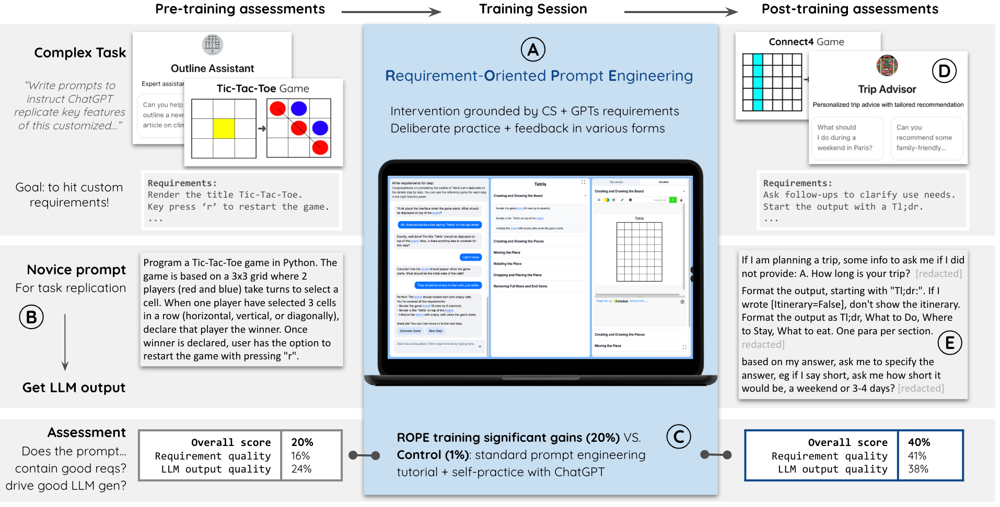

# What Should We Engineer in Prompts? Training Humans in Requirement-Driven LLM Use [(Paper)](https://arxiv.org/abs/2409.08775)



- (A) Our ROPE training help learners write effective prompt programs by providing deliberate practice in adding and clarifying requirements, with various automated feedback. 
- (B) We assess learners' prompt quality on both requirement quality and LLM output quality in a pre-post randomized experimental design. 
- (C) In pre-post assessments, learners write prompt programs to create customized LLM applications (e.g. Trip Advisor in D through a prompt in E).
- We observe that ROPE training significantly improves novices' prompt quality, compared to traditional prompt engineering training. 


**Content Directory**
```
├── README.md
├── study_material
│   ├── reference_reqs_prompts.pdf
│   └── user_study_prompts.csv
└── system
    ├── README.md
    ├── prompts.md
    └── ...
```

## study_material: 
`reference_reqs_prompts.pdf`: 
- pre-post test task descriptions, requirement rubrics, and ground-truths
- prompts for LLM output generation for grading
- prompts for optimizer (Prompt Maker) 

`user_study_prompts.csv`: prompts that users wrote during the pre-post test.

## system:
`README.md`: instructions for setting up the system and add new tasks. 

`prompts.md`: prompts used in the system to generate chat-based feedback, requirement document updates, and code counterfactual.

Video Demo for the training system: https://youtu.be/oJq2DYvw8l0
